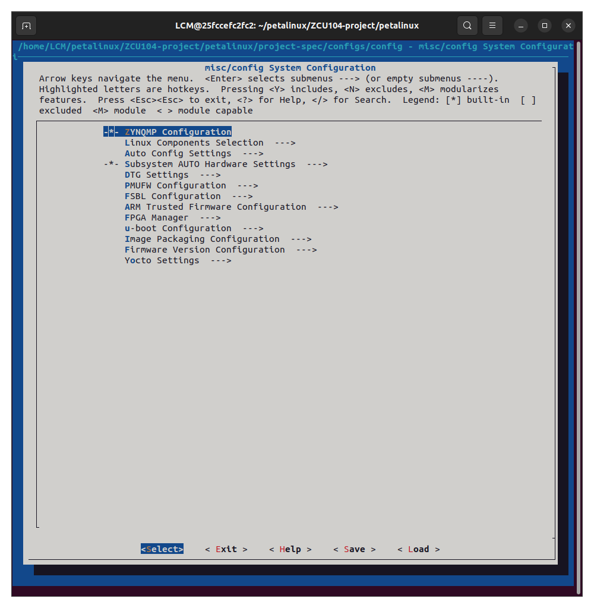
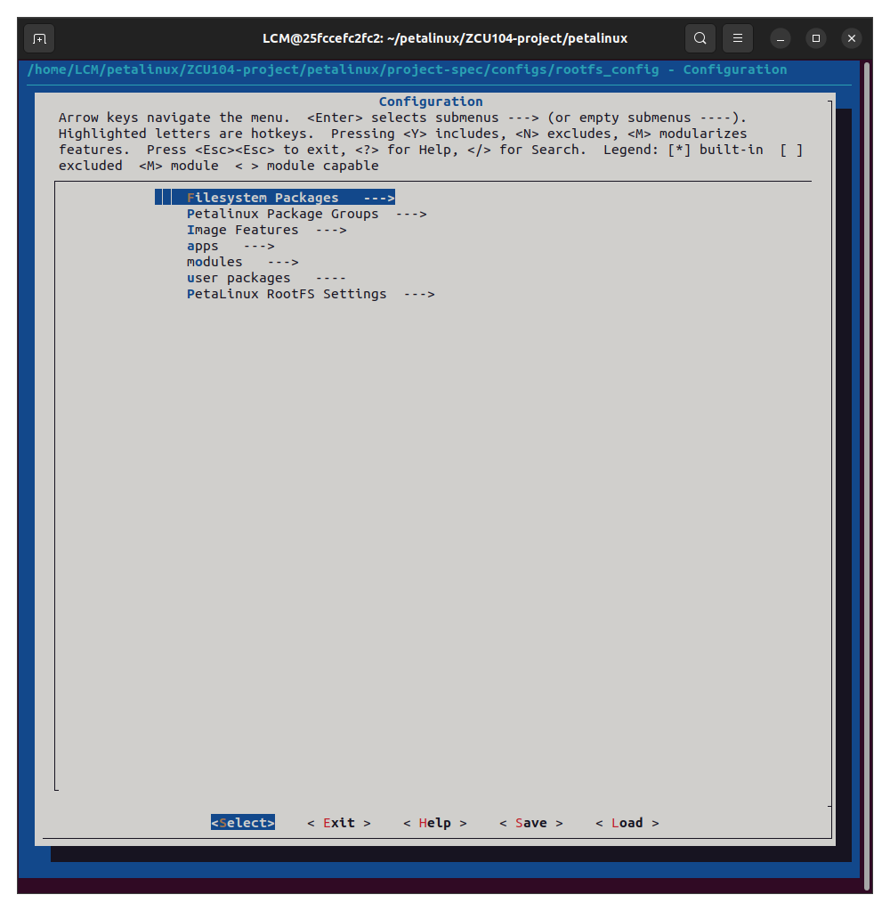
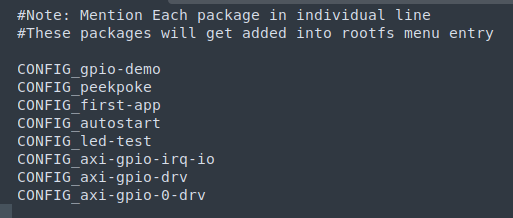
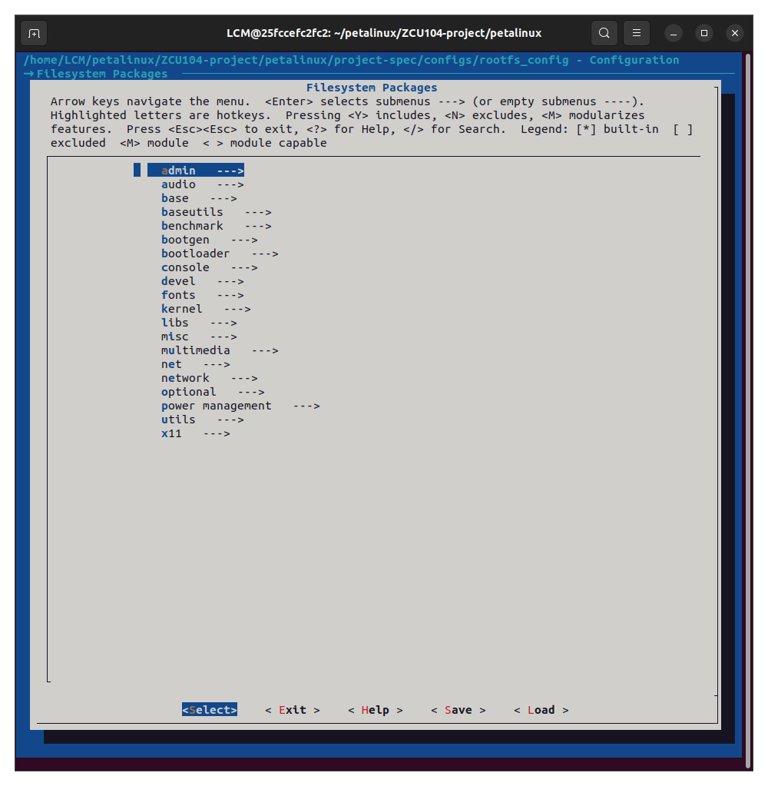

# Petalinux

### 簡介

Petalinux 是一個由 AMD 開發的嵌入式 Linux 開發套件，專為在 AMD 的 FPGA 晶片（如 Zynq、Versal）上開發 Linux 系統而設計。

它提供了一整套工具，簡化了為這些硬體平台建立、設定、編譯和部署客製化 Linux 系統的流程，包括支援 Yocto 專案、Linux 核心、開機載入程式和根檔案系統等組件。

</br>

對於熟悉 Yocto 的人可能可以很快上手，這份工具其實就是 xilinx 將 Yocto 再多包一層可以設定的工具並進行製作 img。

所以其實本身並不難，但基本上還是要先熟悉 Yocto。

</br>

## 使用

這邊先簡單介紹 Petalinux 實際上使用的流程。

### Step 1. 安裝

基本上跟著上一頁的教學一步一步安裝即可。

須注意環境的建立，petalinux 基本上有自己的語法 `petalinux-config` 可以查看。

---

</br>

### Step 2. 建立專案

首先，建立一個基本的 linux kernel 專案想必需要一個底層 hardware，所以我們需要先利用 vivado 建立一個 BSP/DTS 等等，那這個底層就是 vivado export 的 xsa 檔。

有了基本的底層後我們就可以開始一步一步開始建立專案。

我們會需要有很大的記憶體空間（謝謝 yocto）; 除了基本的 BSP 之外我們需要有 u-boot 開機相關的文件，關於 uboot 可以去官網直接下載，這邊需要注意版本，若是版本沒有跟 petalinux 對上之後編譯會出錯。

### Step 2-1. 創建空專案

```bash
$ petalinux-create -t project -n petalinux --template zynqMP
```

各變數說明：
1. -t：type，創建的類型，這邊指創建`專案`
2. -n：name，創建項目的名稱
3. --template：創建的模板，xilinx 提供三種本專案使用的板子為 zynqMP

完成之後就可以看到創立的專案資料夾了。

### Step 2-2. 設定硬體

接下來有關設定該專案的命令都需要在該專案資料夾底下，`cd` 進去。

```bash
$ petalinux-config --get-hw-description /path/to/xsa
```

後面的 `/path/to/xsa` 直接指向 xsa 的資料夾即可。

</br>



</br>

### Step 2-3. 設定專案

在指定完成硬體後，會在終端中跳出一個 UI 介面，接下來就對該 UI 介面進行設定即可。

若是後續需要補設定直接輸入 `petalinux-config` 即可，不用再多次指向硬體。

</br>

接下列出需要設定的選項：

1. linux Components Selection：這裡可以選擇 u-boot 以及 kernel
   - 默認是從 github 上下載，但我們可以先從 xilinx 官網下載，若是需要修改的話需要從官網下載
   - 須注意版本差異！！！（2020.1 -> v5.4）
   - 選擇：
     - u-boot () 進去後，選擇 ext-local-src，之後會出現 External u-boot local source settings 讓我們選擇該路徑
     - linux kernel () 進去後，選擇 ext-local-src，之後會出現 External linux-kernel local source settings 讓我們選擇該路徑

2. Auto Config Settings 
   - kernel autoconfig 以及 u-boot autoconfig 需要勾選

以上兩項設定完成後保存退出即可。

---

</br>

### Step 3. 修改設備樹

進入 /petalinux/project-spec/meta-user/recipes-bsp/device-tree/files/ 裡面會有兩個檔案，選擇 system-user.dtsi 即可。

這邊可以加入對額外的設備的功能，像是 AXI 的擴充之類的。

當我們選擇好 petalinux 的 Hardware 時本身就會有對應的 dtsi 產出，這裡不是自己寫設備樹，而是額外增加的。

</br>

若是想單獨先檢查設備樹可以使用：

```bash
$ petalinux-build -c device-tree
```

但要先記得 `petalinux-config`

之後會產出 system.dtb 這是給機器看的，我們可以利用 device-tree-compiler 反編譯出來 dtsi。

```bash
$ sudo apt install -y device-tree-compiler

$ dtc -I dtb -O dts -o out.dts system.dtb
```

</br>

若要用 SD 卡開機請見 [SD 卡開機](#sd-卡開機)

</br>

---

</br>

### Step 4. Yocto

緊張刺激的時候到了，yocto 本身是很龐大的編譯系統會有一推的下載文件湧入你的電腦，xilinx 有預先提供兩個下載包幫你解決這個問題。

關於下載包的選項可以上網找資源，我這邊是使用 yocto 預設的下載方式，只是需要改一下對應的 url：

```bash
https://petalinux.xilinx.com/sswreleases/rel-v2020/downloads/
```

個人很不推薦使用離線方式，畢竟有些東西還是有人堅持在維護的（謝謝 github 體系）。

之後使用 `petalinux-build` 耐心等待即可。

編譯成功後會在專案資料夾中出現 image/linux 這個資料夾裡面放置我們的編譯結果。

---

</br>

### Step 5. 打包

在 image/linux 資料夾中輸入：

```bash
$ petalinux-package --boot --fsbl --pmufw --u-boot --fpga --force
```

成功後會看到：images/linux/BOOT.BIN

須注意在 vivado export 中需要 include bitstream。

</br>

請先將 SD 卡分割好：

1. rootfs : 放置 root file system
	- images/linux/rootfs.tar.gz
	- 放入後記得解壓縮

2. boot : 放置開機用
	- images/linux/BOOT.BIN
	- images/linux/image.ub
	- images/linux/boot.scr

對應的磁區會有不一樣的分割設定，上網找就好。

若是不知道怎麼用，請參考 DE10-Nano 的燒錄 SD Linux image 方式。

</br>

---

</br>

### Step 6. 手動開機

若是在沒有 boot.scr 的情況下，開機後其實還不會先進入 rootfs 的 user space ，會在 boot 中。

此時我們可以先利用 CLI 的輸入繼續開機，先測試是否東西都正確。

```bash
ZynqMP> mmc dev 0
ZynqMP> mmc rescan
ZynqMP> ls mmc 0:1

ZynqMP> load mmc 0:1 0x8000000 image.ub

ZynqMP> setenv bootargs 'console=ttyPS0,115200 root=/dev/mmcblk0p2 rw rootwait rootfstype=ext4'

ZynqMP> bootm 0x8000000
```

若是成功就會要求登入 root

</br>

### 小節

以上就是整個 petalinux 編譯出一個 yocto linux kernel 的使用方法。

</br>

</br>

# Petalinux 開發

基本上就跟 Yocto 開發一模一樣。

只是需要注意的是 Petalinux 是有經過 xilinx 加工過後的，所以我們不能項以前一樣自由的加 recipes 而是需要透過 Petalinux 所提供的工具來加入才可以。

</br>

以下分成各章節說明，會牽扯到 linux 各項開發建議先擁有基本知識：

### [創建專案](#創建項目)
### [設備樹](#設備樹-1)
### [User Space APP](#user-space-app-2)
### [Linux Kernel Model](#linux-kernel-model-1)
### [執行腳本](#執行腳本-1)
### [編譯](#編譯-1)

</br>

# 創建項目

在 Petalinux 中可以使用工具新增各項需要的功能包括：

### User Space APP

```bash
$ petalinux-create -t apps --template c --name <name> --enable
```

### Kernel Model

```bash
$ petalinux-create -t modules --name <name> --enable
```

### Script

```bash
$ petalinux-create -t apps --template install --name <name> --enable
```

</br>

這邊創建成功之後會提示整個 recipes 的路徑位置。

切記不要直接自己寫 recipes 專案，否則 Petalinux 會報錯。

</br>

創建完成後可以使用 `petalinux-config -c rootfs` 將創建好的 recipes 加入到 image 中，以下說明：



選擇 apps / modules / user packages 找到自己的即可。

</br>

需要先注意，在創建完成後專案的 `meta-user/conf/user-rootfsconfig` 會出現相對應的 config APP 名稱，有了才會出現在 `petalinux-config -c rootfs` 上述畫面中。

若一開始沒有可以先來這邊檢查，示意圖：



</br>

## Filesystem Packages 說明

在整個 Petalinux 系統中只有提供基本能動的動態與靜態函式庫，所以如果自己的 APP 有需要其他的函式庫要先加入，這邊就不詳細說明各項都 Google 的到



</br>

# 設備樹

Petalinux 本身會透過 XSA 生成一個 device tree 但是我們不能直接先更改這個設備樹（system.dtb），要透過 `meta-user/device-tree/files/system-user.dtsi` 去新增內容。

</br>

#### SD 卡開機

以我們需要的 SD 卡開機 為例：

```dts
&sdhci0 {
    status = "okay";
    disable-wp;
    no-1-8-v;
};

&sdhci1 { 
    status = "okay";
    disable-wp;
    no-1-8-v;
};
```

在設樹中新增 SD 卡啟用的相關設定，否則無法利用 SD 卡中的 rootfs 分割磁區。

</br>

## 設備樹說明

嵌入式 Linux 系統中用於描述硬體配置的樹狀資料結構，旨在將硬體描述與 Linux 核心驅動程式分離。它包含節點（Nodes）和屬性（Properties），用以定義 CPU、記憶體、中斷控制器、總線（如 I2C, SPI）及周邊設備的連接關係與資源。 

### 設備樹的主要組成部分

1. DTS（Device Tree Source）檔案：
   - DTS 檔案是裝置樹的原始碼文件，採用 ASCII 文字格式編寫，檔案副檔名為 .dts。
   - DTS 檔案透過樹狀結構描述板級設備訊息，如 CPU 數量、記憶體基底位址、週邊介面（如 IIC、SPI）上連接的設備等。
   - 每個設備在 DTS 檔案中表示為一個節點，節點透過屬性來描述設備訊息，屬性是鍵值對的形式。

2. DTSI（Device Tree Include）文件：
   - DTSI 檔案類似 C 語言中的頭文件，用於描述 SoC 層級的內部週邊資訊，如 CPU 架構、主頻、外設暫存器位址範圍等。
   - DTS 文件可以引用 DTSI 文件，以減少程式碼冗餘，以便於維護和共用。

3. DTC（Device Tree Compiler）工具：
   - DTC 工具用於將DTS檔案編譯成二進位格式的 DTB（Device Tree Blob）檔案。
   - DTC 工具的原始碼位於 Linux 核心的 scripts/dtc 目錄下。

4. DTB（Device Tree Blob）檔案：
   - DTB 檔案是DTS檔案編譯後的二進位文件，由 Linux 核心解析。
   - DTB 檔案包含了設備樹的完整訊息，用於在系統啟動階段配置和初始化硬體設備。

</br>

我們是不用自己把完整的週邊或是 CPU 寫出來，他會根據我們的 XSA 文件先生成好出來。

但建議還是要懂一點語法以便後續自己編輯。

</br>

其語法如：

```dts
peripheral_name@address {
    compatible = " ";
    reg = < >;
    interrupts = < >;
    clocks = < >;
    status = " ";
};
```

- compatible :
   - 告訴 kernel：「我這顆硬體是誰」
   - Kernel 會去找 of_device_id 表裡有沒有對得上的 driver
   - compatible = "xlnx,axi-gpio-2.0", "xlnx,xps-gpio-1.00.a";

- reg
   - 記憶體映射
   - 格式：addr_hi addr_lo size_hi size_lo
   - reg = <0x00 0xa0000000 0x00 0x10000>;

- interrupts
   - 週邊怎麼丟中斷
   - 格式：type irq_number flags
   - interrupt-parent = <&gic>; </br> interrupts = <0 89 4>;

- clocks
   - 週邊時脈
   - clocks = <&clkc 15>; </br> clock-names = "s_axi_aclk";

- status
   - 開或關
   - okay / disabled

</br>

# User Space APP


</br>

# Linux Kernel Model


</br>

# 執行腳本


</br>

# 編譯


</br>