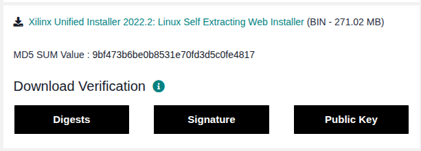
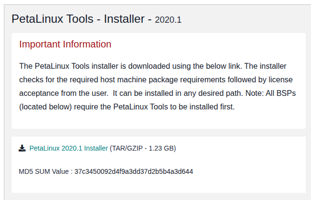

# Xilinx

Xilinx 的軟體本身可以在不同的平台進行設計，官方都有給出不同的下載資源，

這邊一律建議全部都在 linux 還進底下進行。

安裝事宜就不贅述，網路資源很多！！

</br>

- OS : Ubuntu 22.04
- Main Board : AMD Zynq™ UltraScale+™ MPSoC ZCU104 評估套件

</br>

# 三種 IDE 與連結

剛接觸 xilinx 時一定會覺得很麻煩幹嘛分那麼多 IDE 那麼多介面，別急聽我娓娓道來 ～

首先我們正在學習與實做的是 FPGA + Linux + APP 的開發板，兩者之間各有它的好處那何不把他們合再一起。

</br>

讓我們先分清楚三者之間的用途：

1. Vivado 的工作是把「你想要的硬體系統」做出來。
2. Vitis 本質是「軟體開發 + 平台整合」，可以分三類情境：Bare-metal、FreeRTOS 與 Linux。
3. PetaLinux 是「把 Linux 為你的板子客製化」的整合工具。

</br>

那當我們要開始使用時該如何利用這三種不同的 IDE，以我的開發經驗來說，我習慣用以下的 wok-flow：


</br>

文字敘述一下：

先用 Vivado 將我們需要的硬體設計好，包括 PS 與 PL 端，甚至我們需要用到 IP 也一律先做好，再全數編譯完成後 ( Run Implementation ) 輸出 XSA 文件 ( 需要包含 Bitstream )，這就是我們的硬體描述文件了。

接下來，在正式進入 Linux 之前我們可以先用 Vitis 測試一下我們剛剛所設計好的硬體環境，通常如果有問題這邊就會有了。透過導入設計好的 XSA 文件，我們可以選擇需要的系統平台 ( Bare-metal、FreeRTOS 與 Linux，基本 Bare-metal 就夠了 )，在測試完之後就可以先大致確認這個 FPGA 硬體平台是 OK 的。

最後我們可以開始撰寫需要的 Linux 系統了，在搭建好 Petalinux 環境後，我們可以更改設備數或是像 u-boot 這種文件，誘惑是可以開始加入自己的 APP，最後編譯與打包我們的完整 image 給 SD 卡或是其他燒錄方式。

然而撰寫 Linux APP 的方式不只一種，我們可以透過 Petalinux 提供的 SDK 功能將平台的 Linux 底層資訊給 Vitis 做上層 User Space 的開發。


</br>

# Vivado

Version : 2022.2

### 安裝

參考：https://blog.csdn.net/qq_44447544/article/details/128205473

</br>

Step 1. 先至官網下載[安裝包](https://www.xilinx.com/support/download/index.html/content/xilinx/en/downloadNav/vivado-design-tools/archive.html)

這邊我是選 2022.2 可以針對自己想要的開發版去選擇版本，建議也不要選太新有的會有 Bug。

註：網頁的 Vivado Archive 可以選以前的版本。

</br>



</br>

Step 2. 安裝

下載完成後要將 `.bin` 的包更改執行權限在繼續

```bash
$ sudo chmod +x Xilinx_Unified_2022.2_1014_8888_Lin64.bin

# 開始安裝：
$ sudo sh ./Xilinx_Unified_2022.2_1014_8888_Lin64.bin
```

接下來就會跳出安裝的介面，跟這步驟往下做就好。

須注意，有時候會因為網路問題安裝失敗要重新來，有時候會因為少了 OpenCL 的相關套件失敗建議可以先安裝：

```bash
$ sudo apt-get install ocl-icd-libopencl1
$ sudo apt-get install opencl-headers
$ sudo apt-get install ocl-icd-opencl-dev
```

</br>

Step 3. 開啟

根據自己安裝的資料夾先找到 `Vivado/2022.2/settings64.sh` 要先 `source` 一次 bash 環境才可以開始 run vivado。

我們可以將他加入到 `bashrc` 之後開啟終端機的時候就會自動跑了。

開啟的話直接在終端機輸入 vivado 即可。

```bash
$ vivado
```

</br>

### [教學](Vivado/Readme.md)


</br>

# Vitits

Version : 2022.2

### 安裝

安裝可以直接沿用 vivado 上述的下載包直接句選 vitis 就可以了。

同時需要記得要將 `settings64.sh` 也加入到 `bashrc` 。

開啟的話直接在終端機輸入 vitis 即可，建議在後面加一個 `&` 可以保正在背景執行。

```bash
$ vitis&
```

</br>

### [教學](Vitis/Readme.md)

</br>

# Petalinux

Version : 2020.1

### 安裝：

Step 1. 安裝

[安裝](https://www.xilinx.com/support/download/index.html/content/xilinx/en/downloadNav/embedded-design-tools/archive.html)自己想要的版本，但需要注意根據自己載的 Petalinux Version 你的 Kernel 跟 u-boot 會也需要對照版本。

</br>



</br>

以我所安裝的 Petalinux 2020.1 來說：
* [Kernel](https://github.com/Xilinx/linux-xlnx/tree/xlnx_rebase_v5.4) : v5.4
* [u-boot](https://github.com/Xilinx/u-boot-xlnx/tree/xlnx_rebase_v2020.01) : v2020.1

以上兩個包都可以在 Xilinx 的 Github 上倒找到相對應的安裝包。

</br>

執行 Petalinux 的安裝包跟上述都一樣，這邊是建議使用 Docker 將其包起來會比較好，因為他會需要更改很多環境與電腦資源，所以最好獨立出來。

[安裝教學](https://www.bilibili.com/video/BV1qd4y1o7C9/?spm_id_from=333.337.search-card.all.click&vd_source=c0216bc2cffca6d8fd82a48943a835d7)

</br>

由於 Petalinux 本身就是 Yocto 開發的一種，那 Yocto 又是以肥而出名，所以最好可以先將 sstate 與 downloads 安裝好，讓 Yocto 編譯時更快更不會出錯。

相關資源都在官網上。

</br>

### [教學](Petalinux/Readme.md)

</br>

