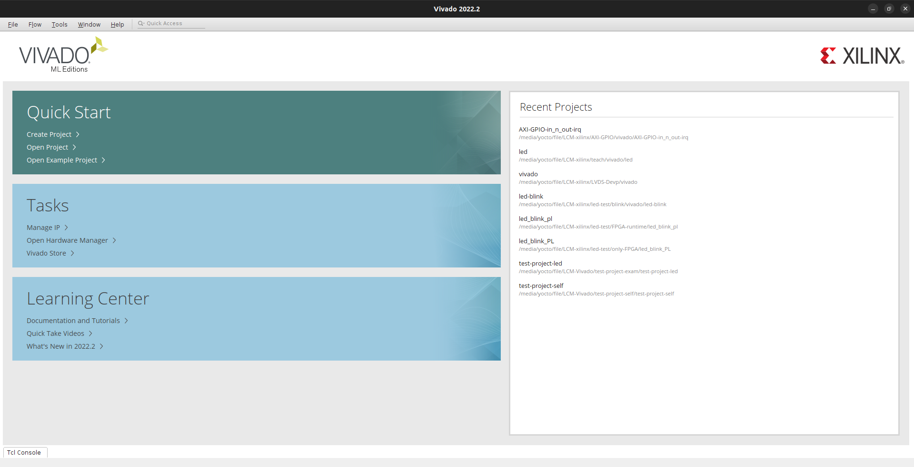
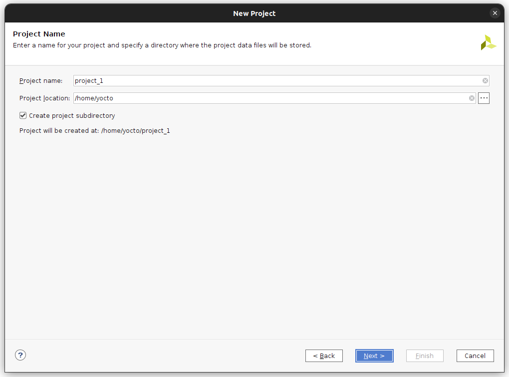
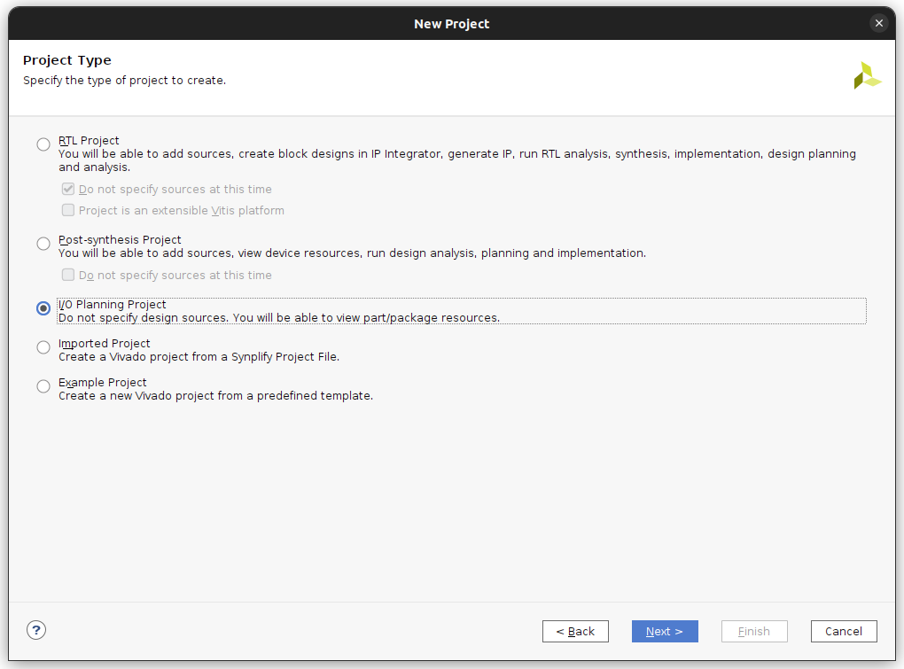
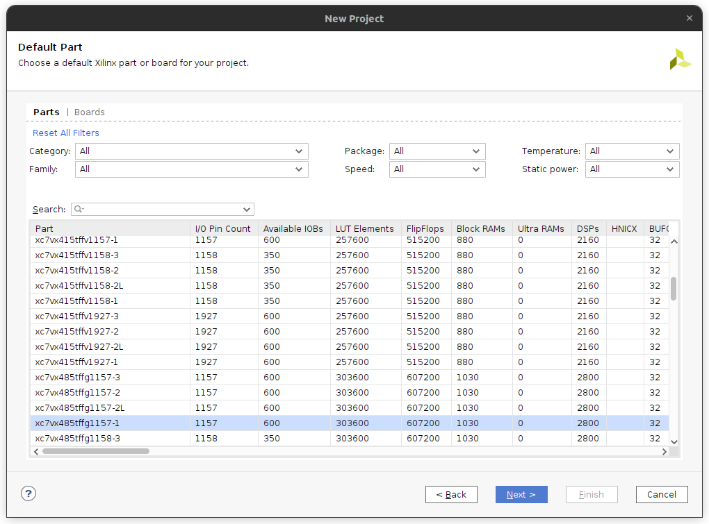
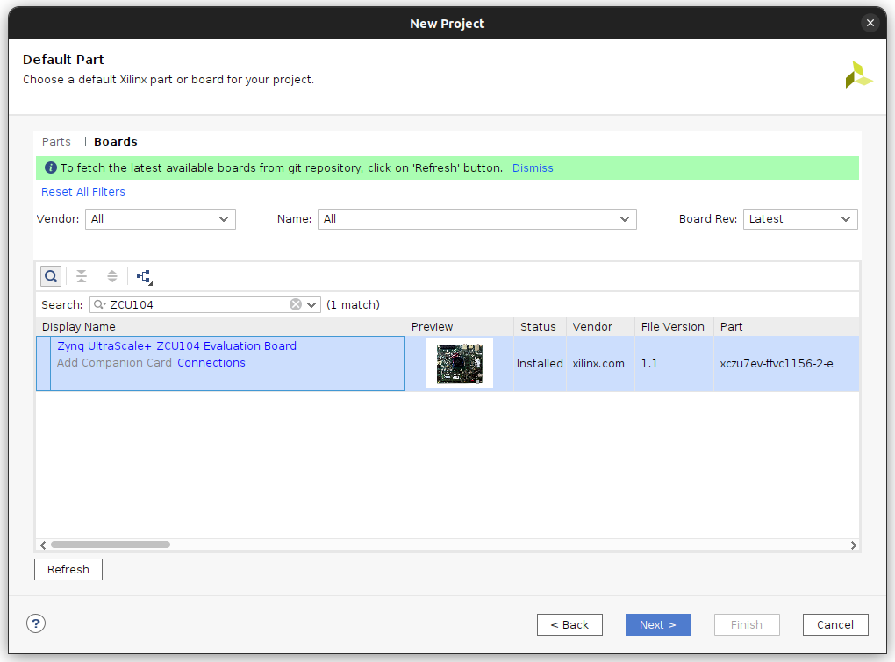
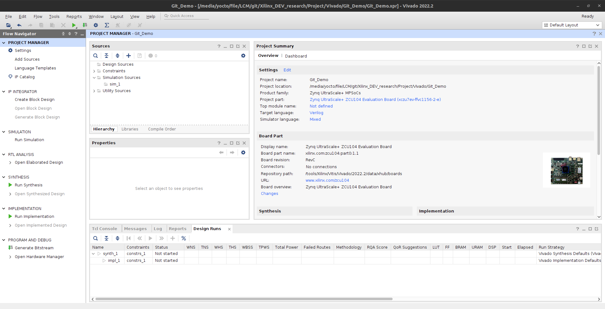
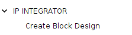
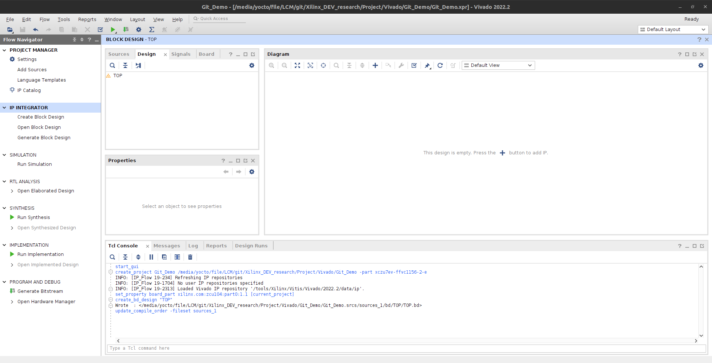
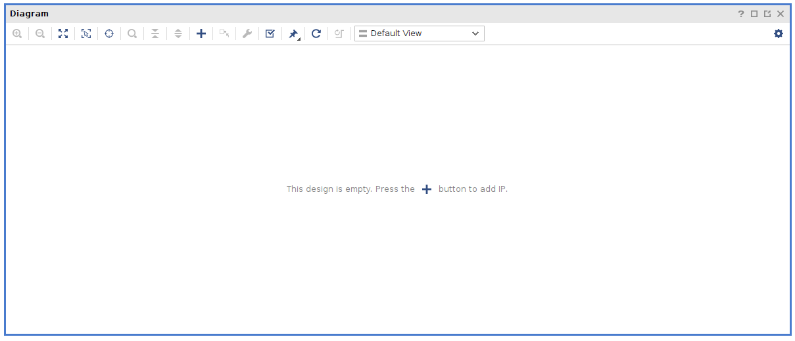
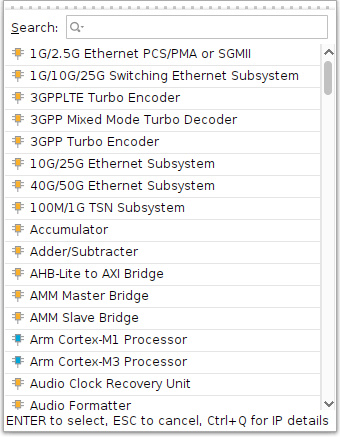

# Vivado

AMD Vivado™ Design Suite 是專為 AMD (前 Xilinx) 自適應 SoC 和 FPGA 設計的整合開發環境 (IDE)，用於將 RTL 代碼（Verilog/VHDL）轉換為可執行硬體。它包含設計輸入、綜合、佈局佈線、驗證、時序分析及產生 Bitstream 文件的一站式工具，支持高效的 IP 整合設計。 

 

Vivado 核心介紹：
- 功能與應用：
    - 核心功能： 支援傳統 RTL 流程與 Block Design (IP 整合) 流程，能快速組裝複雜系統。
    - 高階合成 (HLS)： 可將 C/C++ 代碼轉換為可程式邏輯，加速開發。
    - 硬體除錯： 內建 ChipScope 等除錯核心，方便分析晶片內部邏輯。
    - 應用領域： 廣泛用於通信、數字訊號處理、嵌入式系統等領域的設計。

 

- 關鍵優勢：
    - 加速設計迭代： 相比前代 ISE，Vivado 導入了新技術來縮短編譯時間。
    - 優化性能： 針對賽靈思架構優化，支援大型設計，提供準確的功耗、時序和面積估算。
    - 直觀的 IP 整合： 透過 IP Integrator，可以圖形化方式連接 IP 核，提高設計效率。

 

- 設計流程：
    1. 建立工程 (Project Mode 或 Non-Project Mode)。
    2. 設計輸入 (RTL 或 Block Design)。
    3. 行為級仿真 (Simulation)。
    4. 綜合與實現 (Synthesis & Implementation)。
    5. 時序分析。
    6. 產生 Bitstream 並下載至硬體。

 

---

 

所有設定與教學都專住在 ZCU104

 

# 基本操作 < Sample Project >

如下圖為 Vivado 基本操作介面，說明：

- 新增專案：Create Project

 

- 開啟專案：
    - Open Project
    - Recent Project

 

 

### 新增專案

 

Step 0. 點 Create Project

---

 

Step 1. Project Name

 

專案基本設定 :
- 專案名稱
- 儲存路徑

 

---

 

Step 2. Project Type

這邊選擇創建的專案類型

 

基本選擇 RTL Project
- 這邊可以先點 Do not specify sources at this time

 

---

 

Step 3. Default Part

選擇板子或是晶片，若是直接對開發版開發可以直接選 `Boards` ，針對晶片則是選擇 `Parts`

 

---

 

至此專案的建置就算是完成了，完成後會直接導到基本頁面。

 

 

### 專案設計

在一開始我們需要先創建一個 `Block` 用於放置我們所有的 IP 不管是預設的還是自己製作的。

 

---

 

點選 `IP INTEGRATOR / Create Block Design` 建置一個 `Block`。

 

點選之後會跳出 `Block` 的相關設定：
- 名稱按自己的需求即可，個人習慣叫 TOP
- 路徑按照預設即可

 

完成後畫面：

 

左側的 `Digram` 就是我們放置 IP 的地方。

接下來開始專案使用教學：

### 新增 IP < default >

點選畫面中的 + 號即可新增

 

跳出的畫面可以新增 IP，可以利用搜尋找自己要的 IP

 

基本都是先加入自己的 MPSoC / FPGA 區塊為主。

# 細項說明與筆記部份